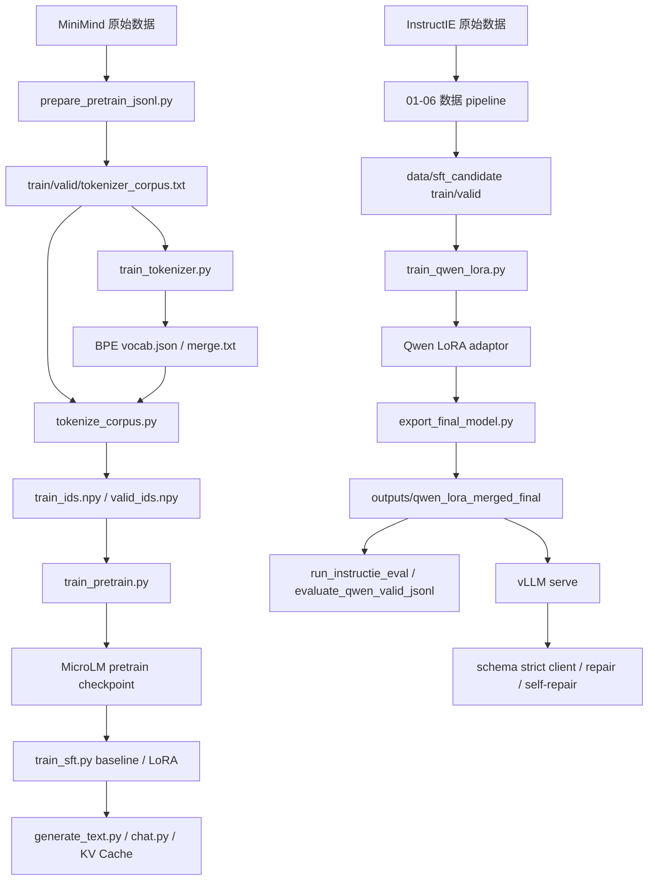

# 00. 恢复总纲

## 1. 项目一句话

MicroLM 是一个轻量级 LLM 全链路项目，覆盖 tokenizer 训练、语料处理、自研 Transformer 预训练、SFT、LoRA、KV Cache 推理、结构化输出评测、Qwen 迁移和 vLLM 服务化部署。

## 2. 当前权威状态

| 项目 | 值 |
|---|---|
| Git 分支 | `main` |
| 恢复锚点提交 | `88c5dffa806d048c129671eeaa0c7c3b194377b0` |
| 提交信息 | `chore: commit project updates` |
| 语言 | Python |
| Python 要求 | `>=3.11` |
| 核心包名 | `microlm` |
| 工作区 | `E:\MicroLM` |

## 3. 两条主线

| 主线 | 目标 | 技术栈 | 结果 |
|---|---|---|---|
| 自研 MicroLM | 从零实现 LLM 训练、微调、推理闭环 | PyTorch + 自实现 tokenizer/model/training | 31.7M 模型，完成 pretrain / SFT / LoRA / KV Cache / chat |
| Qwen 迁移 | 交付结构化信息抽取能力并服务化 | Transformers + PEFT + vLLM | Qwen2.5-1.5B LoRA，完成数据 pipeline、评测、导出、部署 |

核心判断：

- MicroLM 证明“训练链路可以亲手实现”，不作为可靠结构化业务模型。
- Qwen LoRA 是当前推荐部署模型，路径为 `outputs/qwen_lora_merged_final/`。
- 结构化输出必须分层评估：Parse% 只是格式，Strict%/Field F1/Pair F1 才接近任务质量。

## 4. 恢复边界

这个文档包可以恢复：

- 项目结构和模块职责。
- 每条数据和训练 pipeline 的输入、输出、命令、参数。
- 关键模型结构、训练配置、评测指标、部署方式。
- 已知问题和修复思路。
- 关键文件路径和产物索引。

这个文档包不能单独恢复：

- 每个源码文件的逐行内容。
- 原始数据集、模型权重、下载包、WSL 镜像。
- Git 对象数据库和提交历史。
- 大型实验日志的完整字节级内容。

如需字节级恢复，必须配合 Git 仓库或外部备份；本目录负责说明“如何恢复”和“恢复后应该是什么样”。

## 5. 最小恢复路线

1. 获取 Git 仓库，并 checkout 到 `88c5dffa806d048c129671eeaa0c7c3b194377b0`。
2. 建立 Python 3.11+ 环境，安装 `pip install -e ".[all]"`。
3. 跑 `pytest tests/` 验证源码基础。
4. 使用 `data/README.md` 与 `02_DATA_PIPELINES.md` 准备 MiniMind 和 InstructIE。
5. 按 `07_REPRODUCTION_RUNBOOK.md` 跑 smoke，再跑正式训练/评测/部署。

## 6. 全流程图

