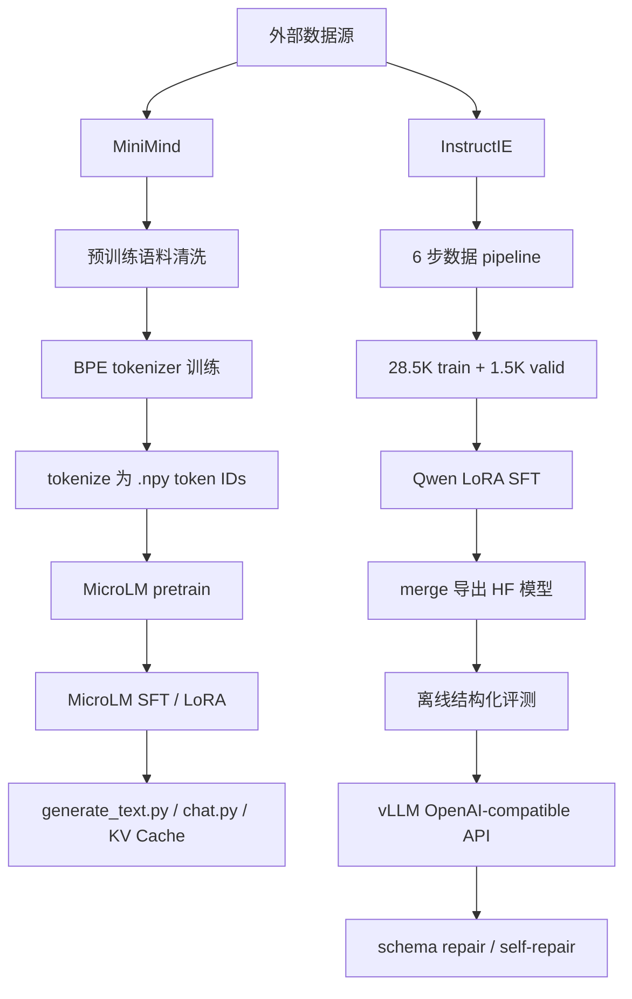

# MicroLM 项目技术全景报告

生成日期：2026-05-23  
工作区：`E:\MicroLM`  
报告范围：当前仓库中的源码、配置、文档、训练产物、评测结果与部署脚本。

---

## 1. 项目定位与核心结论

MicroLM 是一个轻量级 LLM 全链路工程项目，目标不是只调用现成模型，而是把 **数据处理、Tokenizer、Transformer、预训练、SFT、LoRA、推理、评测、部署** 这些关键环节全部打通并沉淀成可复现资产。

项目采用双主线结构：

| 主线 | 目标 | 技术栈 | 模型规模 | 当前状态 |
|---|---|---|---:|---|
| 自研 MicroLM | 从零实现 LLM 训练与推理闭环 | PyTorch + 自实现模块 | 31.7M 参数 | pretrain / SFT / LoRA / KV Cache / chat REPL 已完成 |
| Qwen 迁移线 | 交付结构化信息抽取模型与服务 | HF Transformers + PEFT + vLLM | Qwen2.5-1.5B | 数据 pipeline / LoRA / 评测 / vLLM 部署已完成 |

核心结论：

- 自研链路证明了从 BPE tokenizer 到 TransformerLM、AdamW、SFT loss mask、LoRA 和 KV Cache 都可以在本项目内闭环实现。
- MicroLM 小模型适合展示训练与系统实现能力，但不适合作为可靠结构化 JSON 输出模型，结构化评测 Parse% 为 0%。
- Qwen LoRA 主线是当前推荐部署方向，最终模型为 `outputs/qwen_lora_merged_final/`。
- 结构化输出不能只看 JSON 可解析率。项目把评测拆成 Parse%、Strict%、Alias-Strict%、Projected-Strict%、Field F1、Pair F1 等层次。
- vLLM 服务化已完成 smoke、benchmark 和稳定性验证；schema-strict prompt + repair + self-repair 能显著改善字段契约通过率。

全局路径图：



---

## 2. 仓库结构与资产地图

仓库内核心文件类型统计：

| 类型 | 数量 | 说明 |
|---|---:|---|
| `.py` | 56 | 核心包、训练脚本、评测脚本、测试 |
| `.json` | 132 | 配置、评测 prompt、结果摘要、metadata |
| `.md` | 53 | README、项目分卷文档、实验报告、部署说明 |
| `.toml` | 1 | Python 项目元数据 |

主要目录：

| 路径 | 角色 |
|---|---|
| `microlm/` | 自研 Python 包，包含模型、tokenizer、训练、推理、结构化修复模块 |
| `scripts/` | 可执行入口，覆盖数据处理、训练、推理、评测、vLLM 部署 |
| `configs/` | 各阶段 JSON 配置，包含 smoke 与正式实验 |
| `data/` | 小型 smoke 数据、处理后候选数据、hardcase refinement 数据及 README |
| `eval/` | 固定 prompt 评测集，包括通用生成和结构化抽取 |
| `outputs/` | 训练与导出产物，包括 MicroLM checkpoint、LoRA adaptor、Qwen merged model |
| `results/` | 离线评测、vLLM benchmark、schema-strict stability 结果 |
| `reports/` | 阶段收口报告、终端记录、benchmark 报告 |
| `docs/` | 部署说明，当前重点是 vLLM 部署 |
| `Readme/` | 中文项目全景文档与核心代码解析 |
| `tests/` | 单元测试，覆盖模型、tokenizer、训练、LoRA、SFT、推理、loss dashboard |

核心包内部结构：

| 模块 | 主要文件 | 技术内容 |
|---|---|---|
| `microlm.model` | `transformer.py`, `lora.py`, `kvcache.py` | TransformerLM、RoPE、SwiGLU、RMSNorm、LoRA、KV Cache |
| `microlm.tokenizer` | `bpe.py`, `tokenizer.py` | BPE 训练、GPT-2 regex 预分词、byte-unicode 映射、encode/decode |
| `microlm.training` | `data_loader.py`, `loss.py`, `optimizer.py`, `scheduler.py`, `sft.py`, `checkpoint.py` | batch 采样、loss、AdamW、LR schedule、SFT 协议、checkpoint |
| `microlm.inference` | `prompting.py` | 单轮 prompt 与 conversations JSON/path 统一解析 |
| `microlm.structured` | `schema_repair.py` | schema projection、字段 alias、枚举归一化、self-repair prompt |

---

## 3. 环境与依赖

项目元数据位于 `pyproject.toml`。

| 项目 | 值 |
|---|---|
| 包名 | `microlm` |
| 版本 | `0.1.0` |
| Python | `>=3.11` |
| 构建系统 | `setuptools>=68`, `wheel` |
| 测试 | `pytest`, 默认 `pytest -q tests` |
| License | MIT |

核心依赖：

| 依赖 | 用途 |
|---|---|
| `torch` | 模型、训练、推理、checkpoint |
| `numpy` | token IDs、memmap、批采样 |
| `einops>=0.8.1` | attention / RoPE 张量重排 |
| `regex>=2024.11.6` | GPT-2 风格 Unicode 正则预分词 |
| `wandb>=0.19.7` | 训练日志，可通过 config 禁用 |

可选依赖：

| extra | 依赖 | 用途 |
|---|---|---|
| `microlm[qwen]` | `transformers>=4.40`, `peft>=0.12`, `datasets>=2.18`, `requests>=2.31` | Qwen LoRA、评测、vLLM API 调用 |
| `microlm[dev]` | `pytest>=8.3.4` | 单元测试 |
| `microlm[all]` | qwen + dev | 推荐完整安装 |

部署侧额外环境：

| 项目 | 当前记录 |
|---|---|
| WSL distro | `MicroLM-Ubuntu` |
| vLLM venv | `/root/.venvs/microlm-vllm` |
| vLLM | `0.21.0` |
| torch | `2.11.0+cu130` |
| GPU | NVIDIA GeForce RTX 5060 Ti |
| 服务模型 | `/mnt/e/MicroLM/outputs/qwen_lora_merged_final` |

---

## 4. 数据体系

### 4.1 MiniMind：自研 MicroLM 主线

MiniMind 用于 MicroLM 的预训练和 SFT。

| 数据 | 路径 / 来源 | 规模与用途 |
|---|---|---|
| 预训练语料 | `data/pretrain_t2t_mini.jsonl`，来源 `jingyaogong/minimind_dataset` | 原始 1,270,238 条，约 1.24 GB |
| SFT 对话数据 | `data/minimind_sft/gongjy/minimind_dataset/sft_t2t_mini.jsonl` | MicroLM 全参 SFT 和 LoRA SFT |
| smoke 数据 | `data/smoke/`, `data/sft_smoke/` | 快速验证训练、tokenizer、SFT 协议 |

预训练语料处理由 `scripts/prepare_pretrain_jsonl.py` 完成：

1. 读取 JSONL 中的 `text` 字段。
2. 替换 `<|im_end|>`, `<|im_start|>`, `<think>`, `</think>` 等模板残留。
3. 清理控制字符、HTML 标签。
4. 压缩空白。
5. 进行长度过滤和 SHA256 精确去重。
6. 用 SHA1 哈希做确定性 train/valid 切分，默认 99:1。
7. 文档间插入 EOS 分隔符。
8. 输出 `train.txt`, `valid.txt`, `tokenizer_corpus.txt`, `metadata.json`。

已记录处理结果：

| 指标 | 数值 |
|---|---:|
| train 文档 | 1,251,547 |
| valid 文档 | 12,504 |
| HTML 标签清理 | 7,625 条，0.60% |
| 空白压缩 | 59,393 条，4.68% |
| 精确去重 | 255 条，0.02% |
| 总过滤率 | 0.49% |

### 4.2 InstructIE：Qwen 结构化输出主线

InstructIE 用于 Qwen2.5-1.5B-Instruct 的结构化信息抽取 LoRA 微调。

| 项目 | 数值 |
|---|---:|
| 原始 train | 171,471 |
| 原始 valid | 1,004 |
| 原始 test | 1,002 |
| topic schema | 12 类 |
| 最终 train | 28,500 |
| 最终 valid | 1,500 |
| 最终格式 | chat-style JSONL |

6 步 pipeline：

| 步骤 | 脚本 | 功能 | 关键产物 |
|---|---|---|---|
| 1 | `01_normalize.py` | 字段标准化：`text`/`input` 对齐、relation 字段兼容、cate 归一 | `normalized_*.jsonl` |
| 2 | `02_filter.py` | 硬过滤 + topic 内 P99 软过滤 | `filtered_train.jsonl`, `filter_report.json` |
| 3 | `03_quality_tier.py` | 按 head/tail 原文匹配率、关系数、输入长度分层 | `tiered_train.jsonl`, `quality_report.json` |
| 4 | `04_derive_tasks.py` | 派生 4 类 SFT 任务 | `derived_all.jsonl`, `derive_report.json` |
| 5 | `05_stratified_sample.py` | 按 task/topic/quality/complexity 分层采样 | `sampled_train.jsonl`, `sample_report.json` |
| 6 | `06_to_chat_jsonl.py` | 转为 chat-style JSONL，并切分 valid | `data/sft_candidate/train.jsonl`, `valid.jsonl` |

核心阈值位于 `scripts/conf.py`：

| 类别 | 配置 |
|---|---|
| 硬过滤 | `min_relations=1`, `max_relations=25`, `min_input_len=15`, `max_input_len=800`, `max_output_json_len=2500`, `max_head_tail_len=100` |
| 软过滤 | input/output/relation/head-tail 长度取 topic 内 P99 |
| 质量分层 | high 需要 head/tail 匹配率 1.0；medium 阈值 0.8 |
| 理想区间 | relation 数 2-10；input 长度 30-400 |
| 采样 | `candidate_target=30000`, `internal_valid_ratio=0.05`, `random_seed=42` |

四类任务配比：

| 任务 | 比例 | 目的 |
|---|---:|---|
| `ie_extraction` | 50% | 标准 schema-guided 信息抽取 |
| `text_to_json` | 25% | 文本到 JSON 结构化转换 |
| `format_following` | 15% | 强化格式遵循 |
| `schema_repair` | 10% | 学习修复扰动 JSON |

---

## 5. 自研 MicroLM 技术线

### 5.1 Tokenizer

Tokenizer 由 `microlm/tokenizer/bpe.py` 和 `microlm/tokenizer/tokenizer.py` 实现。

BPE 训练流程：

1. 以 256 个单字节初始化 vocab。
2. 用 special token 正则切分语料，避免 special token 被普通 BPE 合并破坏。
3. 使用 GPT-2 风格 regex 做预分词：
   - 英文缩写；
   - Unicode 字母；
   - Unicode 数字；
   - 标点；
   - 空白与换行。
4. 统计相邻 byte-pair 频次。
5. 每轮选择频次最高的 pair 合并。
6. 保存 `vocab.json` 和 `merge.txt`。
7. 使用 GPT-2 标准 byte-to-unicode 映射，让任意字节都能写入文本 vocab。

正式 tokenizer 配置：

| 项目 | 值 |
|---|---|
| config | `configs/tokenizer_full_clean.json` |
| input | `data/pretrain_clean/tokenizer_sample.txt` |
| output | `outputs/tokenizer_full_clean/` |
| vocab_size | 6400 |
| special_tokens | `<|endoftext|>` |
| 产物 | `vocab.json`, `merge.txt` |

`BPETokenizer` 支持：

- `from_files()`：兼容 `{id: token}` 与 `{token: id}` 两种 vocab JSON。
- `encode()`：按 special token 精确匹配切分，再对普通片段做 BPE。
- `decode()`：token bytes 拼接后 UTF-8 decode，错误用 replacement char。
- `encode_iterable()`：面向大文本流式编码，在换行或空格安全边界截断 buffer，避免 chunk 边界破坏 tokenization。

### 5.2 TransformerLM 模型结构

核心实现位于 `microlm/model/transformer.py`。

正式模型配置：

| 参数 | 值 |
|---|---:|
| vocab_size | 6400 |
| context_length | 512 |
| d_model | 512 |
| num_layers | 8 |
| num_heads | 8 |
| d_head | 64 |
| d_ff | 1344 |
| rope_theta | 1,000,000 |
| norm | RMSNorm |
| norm_mode | pre-norm |
| FFN | SwiGLU |

模块实现：

| 模块 | 技术细节 |
|---|---|
| `Linear` | 自定义权重矩阵，`torch.einsum("... i, o i -> ... o")` 计算线性层 |
| `Embedding` | 手写 embedding lookup，权重 shape 为 `[vocab, d_model]` |
| `RMSNorm` | fp32 计算 RMS 后转回输入 dtype，提升 fp16 稳定性 |
| `SwiGLU` | `W2(SiLU(W1(x)) * W3(x))` |
| `SiLU_FFN` | 可选 SiLU-only FFN，`d_ff=4*d_model` |
| `RotaryPositionalEmbedding` | 预计算 cos/sin buffer，支持 batch/head 维广播 |
| `scaled_dot_product_attention` | 手写 attention，score/softmax 路径使用 fp32 |
| `MultiHeadSelfAttention` | q/k/v/output 四个投影，支持 RoPE 与 KV Cache |
| `TransformerBlock` | pre-norm residual attention + FFN |
| `TransformerLM` | token embedding → N blocks → final norm → lm_head |

前向 shape：

```text
token_ids: [batch, seq]
x:         [batch, seq, d_model]
q/k/v:     [batch, head, seq, d_head]
scores:    [batch, head, q_seq, k_seq]
logits:    [batch, seq, vocab_size]
```

KV Cache：

- `KVCache` 保存每层历史 `k`/`v`。
- prefill 阶段一次性处理 prompt，写入每层 cache。
- decode 阶段每次只输入最新 token，复用历史 K/V。
- `use_cache=True` 时 attention 不再构造 causal mask，因为每次 query 只看已有历史 + 当前 token。

生成接口：

- `TransformerLM.generate()` 支持 `max_new_tokens`, `eos_token_id`, `temperature`, `top_p`。
- `_top_p_filter()` 保留累积概率达到 p 的最小 token 集，并保证至少保留最高概率 token。
- 当前实现要求 `prompt_len + max_new_tokens <= context_length`。

### 5.3 Pretrain 训练闭环

预训练入口：`scripts/train_pretrain.py`。

数据：

- 输入为 `.npy` 或 `np.memmap` token IDs。
- `get_batch()` 从 token 序列随机采样连续窗口：
  - `x = dataset[i : i + context_length]`
  - `y = dataset[i + 1 : i + context_length + 1]`

loss：

- `cross_entropy(logits, targets)` 手写 stable softmax loss。
- 先减去 logits 最大值，避免指数溢出。

优化：

- 自实现 `AdamW`，含 bias correction 和 decoupled weight decay。
- 学习率为 warmup + cosine decay：
  - `t < Tw` 线性 warmup；
  - `Tw <= t <= Tc` cosine 从 `alpha_max` 到 `alpha_min`；
  - `t > Tc` 固定 `alpha_min`。
- `gradient_clipping()` 计算全局 L2 norm 后缩放梯度。
- `save_checkpoint()` 保存 model、optimizer、iteration。

正式配置 `configs/pretrain_full_corpus.json`：

| 类别 | 参数 |
|---|---|
| data | `data/pretrain_clean/tokenized_full/train_ids.npy`, `valid_ids.npy` |
| model | 8 层，512 hidden，8 heads，context 512，SwiGLU，RoPE |
| optimizer | lr `2e-4`, min_lr `2e-5`, warmup `2000`, weight_decay `0.1`, max_norm `1.0` |
| training | batch_size `8`, max_iters `50000`, device `cuda`, seed `42` |
| output | `outputs/pretrain_full_corpus/` |

预训练产物：

| 文件 | 说明 |
|---|---|
| `outputs/pretrain_full_corpus/ckpt_final.pt` | 最终 checkpoint，约 377 MB |
| `outputs/pretrain_full_corpus/model_config.json` | 模型结构固化 |
| `outputs/pretrain_full_corpus/resolved_train_config.json` | 运行参数固化 |

### 5.4 SFT 数据协议与训练

SFT 协议位于 `microlm/training/sft.py`。

支持角色：

| role | marker |
|---|---|
| `system` | `<|system|>\n` |
| `user` | `<|user|>\n` |
| `assistant` | `<|assistant|>\n` |
| `tool` | `<|tool|>\n` |

SFT 渲染规则：

- 每个 message 写入 role marker、content、换行。
- assistant 消息后追加 EOS token 与换行。
- 生成 prompt 时追加 `<|assistant|>\n`，但不附带答案。

loss mask：

- 输入 token 全部参与前向。
- label 默认全部为 `-100`。
- 只在 assistant header 到 EOS boundary 之间填入真实 token id。
- `masked_cross_entropy()` 只对 `labels != -100` 的位置求平均。

系统提示增强：

- `maybe_add_system_prompt()` 可按 `system_prompt_ratio` 随机注入系统提示。
- 默认提示包含中文/英文 assistant 身份描述。

SFT 入口：`scripts/train_sft.py`。

关键工程点：

- 支持 config + CLI 覆盖。
- 支持从 pretrain checkpoint 初始化。
- 如果 tokenizer 注册 special token 后实际 vocab 大于模型 vocab，会 resize embedding 和 lm_head。
- 可选 `--use-lora` 注入 LoRA。
- 支持 DataLoader 多 worker、prefetch、pin_memory。
- 保存 `ckpt.pt`, `ckpt_final.pt`, `train_log.jsonl`，LoRA 模式额外保存 `lora_adaptor.pt`。

正式全参 SFT 配置 `configs/sft_baseline.json`：

| 类别 | 参数 |
|---|---|
| init | `outputs/pretrain_full_corpus/ckpt_final.pt` |
| tokenizer | `outputs/tokenizer_full_clean/vocab.json`, `merge.txt`, `<|endoftext|>` |
| optimizer | lr `1e-5`, weight_decay `0.1` |
| training | batch_size `2`, eval_interval `50`, save_interval `200`, device `cuda` |
| data | MiniMind SFT train/valid |
| output | `outputs/sft_baseline/` |

当前 `outputs/sft_baseline/train_log.jsonl` 记录到 step 3000，val_loss 从约 2.35 降至约 2.20。

### 5.5 MicroLM LoRA

LoRA 实现位于 `microlm/model/lora.py`。

核心公式：

```text
output = W x + (alpha / r) * B A x
```

实现细节：

- `LoRALinear` 包裹原始 `Linear`。
- 原始权重 `requires_grad=False`。
- A shape 为 `[r, in_features]`，Kaiming uniform 初始化。
- B shape 为 `[out_features, r]`，零初始化。
- LoRA 参数与原始权重使用同一 device。
- `merge()` 将 `delta = B @ A * scaling` 加回原始权重，适合推理。
- `unmerge()` 可撤销。
- `get_lora_state_dict()` 只保存 A/B 权重。

默认目标层：

```text
q_proj, k_proj, v_proj, output_proj
```

正式 LoRA SFT 配置 `configs/sft_lora.json`：

| 项目 | 值 |
|---|---|
| r / alpha | 8 / 16 |
| target | q/k/v/output projection |
| lr | `3e-5` |
| weight_decay | `0.0` |
| train data | `sft_t2t_train_995.jsonl` |
| valid data | `sft_t2t_valid_005.jsonl` |
| output | `outputs/sft_lora/` |

量化结果：

| 指标 | 数值 |
|---|---:|
| 可训练参数占比 | 0.83%，262K / 31.7M |
| adaptor 大小 | 约 1.0 MB |
| 全参 checkpoint | 约 377 MB |
| 存储节省 | 约 99.7% |
| 当前 LoRA val_loss | 约 2.303 |

### 5.6 MicroLM 推理与系统能力

单轮推理入口：`scripts/generate_text.py`。

能力：

- 加载 checkpoint。
- 默认从 checkpoint 同目录读取 `model_config.json`。
- 加载 BPE tokenizer。
- 支持 `--prompt`、`--conversations-json`、`--conversations-path` 三种输入。
- 支持 `temperature`、`top_p`、`max_new_tokens`。
- 支持 `float32`、`float16`、`bfloat16` 和 `device=auto`。

多轮聊天入口：`scripts/chat.py`。

能力：

- 加载全参或 LoRA 模型。
- 支持系统提示。
- 支持温度、top-p、max_new_tokens。
- 支持 `/history`、`/save`、`/quit` 等 REPL 命令。
- 保存 JSONL 会话日志。
- 清理 Unicode surrogate，避免历史累积导致 UTF-8 encode 崩溃。

KV Cache benchmark：`scripts/benchmark_kvcache.py`。

现有结果 `results/kvcache_benchmark.csv`：

| 指标 | 数值 |
|---|---:|
| 测试配置 | 5 种 prompt 长度 × 4 种生成长度 = 20 组 |
| 平均加速比 | 3.86x |
| 最大加速比 | 9.08x |
| 最大加速配置 | prompt=256, gen=256 |
| cache decode 平均吞吐 | 约 100 tok/s |
| no-cache 平均吞吐 | 约 31.6 tok/s |

结论：KV Cache 的收益随 prompt 和生成长度增加而变大，decode 阶段吞吐更稳定。

---

## 6. Qwen 迁移与结构化输出技术线

### 6.1 迁移动机

MicroLM 证明了训练链路和工程闭环，但在结构化 JSON 任务上能力不足。项目因此将可部署结构化输出能力迁移到 Qwen2.5-1.5B-Instruct。

决策逻辑：

```text
MicroLM JSON Parse%=0%
  -> 31M 小模型难以稳定满足结构化输出
  -> 使用 Qwen2.5-1.5B-Instruct 作为基座
  -> 用 InstructIE 做 schema-guided 信息抽取 LoRA
  -> 用自动评测和 vLLM 服务验证部署可行性
```

### 6.2 Qwen LoRA 训练

训练入口：`scripts/train_qwen_lora.py`。

数据集类：`InstructIEDataset`。

关键逻辑：

- 读取 6A chat-style JSONL 的 `messages`。
- 可注入统一 system prompt。
- 用 Qwen tokenizer 的 `apply_chat_template()` 渲染完整对话。
- 单独渲染 prefix，即 assistant 输出前的部分。
- labels 对 prefix 全部置 `-100`，只训练 assistant JSON 答案。
- 超过 `max_length` 时保留 tail，避免长 IE prompt 截断掉 assistant JSON。
- collate 时 batch 内动态 padding，pad id 为 Qwen pad token `151643`，labels padding 为 `-100`。

正式配置 `configs/qwen_lora_structured.json`：

| 项目 | 值 |
|---|---|
| base model | `./Qwen2.5-1.5B-Instruct` |
| system prompt | 严格 schema 信息抽取助手，只输出 JSON |
| LoRA r / alpha | 8 / 16 |
| target modules | `q_proj`, `k_proj`, `v_proj`, `o_proj` |
| dropout | 0.05 |
| optimizer | AdamW, lr `2e-5`, weight_decay `0.01` |
| batch | batch_size 4, grad_accum 4, effective batch 16 |
| max_steps | 2000 |
| warmup_steps | 100 |
| max_length | 512 |
| precision | FP16 |
| output | `outputs/qwen_lora/` |

训练结果 `outputs/qwen_lora/train_log.jsonl`：

| step | train_loss | val_loss |
|---:|---:|---:|
| 100 | 0.372947 | 0.402493 |
| 500 | 0.255109 | 0.205028 |
| 1000 | 0.150461 | 0.177738 |
| 1500 | 0.210959 | 0.165426 |
| 2000 | 0.186020 | 0.155349 |

LoRA 参数效率：

| 指标 | 数值 |
|---|---:|
| 基座参数 | 1,543,714,304 |
| 可训练 LoRA 参数 | 约 2.18M |
| 可训练占比 | 0.14% |
| adaptor 大小 | 约 8.3 MB |
| 基座模型大小 | 约 2,944 MB |
| 存储节省 | 约 99.7% |

### 6.3 模型导出

导出入口：`scripts/export_final_model.py`。

流程：

1. 检查 `transformers` 与 `peft` 依赖。
2. 加载 base model 和 tokenizer。
3. 加载 PEFT adaptor。
4. 执行 `merge_and_unload()`。
5. 保存 HuggingFace CausalLM 格式目录。
6. 写出 `export_metadata.json`。

推荐部署模型：

```text
outputs/qwen_lora_merged_final/
```

导出元信息：

| 项目 | 值 |
|---|---|
| timestamp | 2026-05-20 23:02:02 |
| base_model | `E:\MicroLM\Qwen2.5-1.5B-Instruct` |
| adaptor_path | `E:\MicroLM\outputs\qwen_lora\adaptor_final` |
| total_params | 1,543,714,304 |
| elapsed_sec | 6.9 |
| PEFT version | 0.19.1 |

hardcase refinement：

- 配置为 `configs/qwen_lora_refine_hardcases.json`。
- 使用 `outputs/qwen_lora_merged_final` 作为 base。
- 训练 300 step，lr `1e-5`。
- 产物为 `outputs/qwen_lora_refine/` 与 `outputs/qwen_lora_merged_refined_best/`。
- 现有报告结论是不建议替换默认部署模型，因为 hardcase replay 未带来稳定收益。

---

## 7. 结构化评测与修复体系

### 7.1 通用生成评测

入口：`scripts/run_eval_prompts.py`。  
评测集：`eval/prompts_v1.json`。

功能：

- 同一 prompt 集对比 pretrain、SFT baseline、LoRA。
- 支持加载 LoRA adaptor。
- 产出原始生成结果 JSON，供人工质检和能力边界分析。

当前 40 prompt 结果摘要：

| 模型 | Prompt 数 | 平均延迟 |
|---|---:|---:|
| pretrain | 40 | 约 1.069s |
| baseline | 40 | 约 1.008s |
| lora | 40 | 约 1.010s |

项目记录中的人工质量结论：

- SFT 相比 pretrain 评分提升约 81%。
- MicroLM LoRA 生成质量约达到全参 SFT 的 85%，val_loss 差距约 9%。

### 7.2 结构化四模型评测

入口：`scripts/run_instructie_eval.py`。  
评测集：`eval/prompts_instructie.json`。  
结果目录：`results/instructie_eval/`。

检测维度：

- JSON Parse%。
- required 字段缺失率。
- schema 外字段幻觉率。
- enum 约束。
- Strict%：所有硬性检查通过。
- Alias-Strict%：字段别名归一化后再检查。

leaderboard：

| 模型 | Parse% | Strict% | Alias-Strict% | 缺字段率 | 幻觉字段率 |
|---|---:|---:|---:|---:|---:|
| qwen_base | 100.0% | 10.0% | 7.5% | 82.5% | 65.0% |
| qwen_lora | 97.5% | 7.5% | 15.0% | 80.0% | 67.5% |
| microlm_sft | 0.0% | 0.0% | 0.0% | 100.0% | 0.0% |
| microlm_lora | 0.0% | 0.0% | 0.0% | 100.0% | 0.0% |

结构化行为质量：

| 指标 | qwen_base | qwen_lora |
|---|---:|---:|
| 实体做 key 率 | 57.5% | 95.0% |
| 全中文字段率 | 55.0% | 92.5% |
| 平均字段重叠率 | 16.97% | 49.0% |

解读：

- Qwen LoRA 的 raw Strict% 不高，但 Alias-Strict% 是 base 的 2 倍。
- LoRA 更强地学到了 InstructIE 风格和中文字段表达，但也更倾向实体嵌套 JSON。
- 部署时需要 schema-strict prompt 与 repair 层，把实体嵌套投影为 schema-field flat JSON。

### 7.3 200 条 valid JSONL 评测

入口：`scripts/evaluate_qwen_valid_jsonl.py`。  
结果：`results/qwen_valid_eval_200/summary.json`。

| 指标 | 数值 |
|---|---:|
| sample_count | 200 |
| Parse% | 100.0% |
| Direct JSON% | 100.0% |
| Exact Match% | 20.0% |
| avg_field_precision | 87.49% |
| avg_field_recall | 73.44% |
| avg_field_f1 | 78.40% |
| avg_pair_precision | 77.97% |
| avg_pair_recall | 62.38% |
| avg_pair_f1 | 67.31% |
| avg_latency | 1.031s/sample |

分任务 exact match：

| task | 样本数 | Exact Match |
|---|---:|---:|
| `schema_repair` | 17 | 94.12% |
| `ie_extraction` | 100 | 14.00% |
| `text_to_json` | 57 | 12.28% |
| `format_following` | 26 | 11.54% |

### 7.4 Schema Repair

核心模块：`microlm/structured/schema_repair.py`。

设计原则：

- repair 层保守处理，只投影已有 JSON 中能对应 schema 的字段。
- 评测模式下不凭空发明缺失值。
- 服务契约模式可以用 `fill_missing=True` 补齐 required 字段，string/list 缺失填 `None` 或 `[]`。

主要能力：

| 函数 | 作用 |
|---|---|
| `clean_model_output()` | 去掉 markdown code fence |
| `try_parse_json()` | JSON 解析，并用 `object_pairs_hook` 合并重复 key |
| `normalize_field_name()` | 字段 alias 到 canonical 字段 |
| `repair_to_schema()` | 递归扫描实体嵌套/列表/平铺 JSON，投影到 allowed schema fields |
| `coerce_enum_value()` | 少量枚举归一化，如材料、用途、所属科室 |
| `score_repaired_fields()` | 检查 missing、extra、enum 和 schema_strict |
| `build_schema_strict_messages()` | 构建强约束 prompt，要求顶层 key 只能来自 schema |

字段 alias 覆盖例子：

| canonical | alias |
|---|---|
| `创办者` | 创始人、创建者、建立者、发起人 |
| `位于` | 位置、地点、所在地、地址、举办地 |
| `发生时间` | 时间、举办时间、开始时间、结束时间 |
| `症状` | 主要症状、常见症状、临床表现 |
| `作者` | 创作者、编写者 |

### 7.5 Schema-Strict Stability 与 Self-Repair

入口：

- `scripts/check_structured_stability.py`
- `scripts/structured_vllm_client.py`

三轮 stability：

| 轮次 | 模式 |
|---|---|
| Round 1 | normal chat completion |
| Round 2 | `response_format={"type": "json_object"}` |
| Round 3 | schema-strict prompt + response_format |

结果 `results/vllm_benchmark_schema_strict/stability_summary_20260521_211457.csv`：

| 轮次 | Parse% | Strict% | Alias-Strict% | Projected-Strict% | Projected-Alias% | avg latency |
|---|---:|---:|---:|---:|---:|---:|
| normal | 100.0% | 0.0% | 0.0% | 20.0% | 37.5% | 2.498s |
| constrained | 100.0% | 0.0% | 0.0% | 20.0% | 37.5% | 2.493s |
| schema-strict | 100.0% | 52.5% | 52.5% | 75.0% | 75.0% | 2.436s |

客户端 repair 结果：

| 模式 | 指标 |
|---|---:|
| schema-strict + repair | repair_strict_rate 77.5%，avg latency 2.432s |
| schema-strict + self-repair | 9/40 使用二阶段补问，repair_strict_rate 100.0%，avg latency 3.176s |

重要边界：

- Parse%=100% 只说明输出是合法 JSON。
- Projected-Strict% 说明经过服务层 schema projection 后字段契约可满足。
- Exact Match / Field F1 / Pair F1 才能衡量内容语义正确性。

---

## 8. vLLM 部署与服务化

部署文档：`docs/vllm_deploy.md`。  
启动脚本：

- Windows/WSL：`scripts/start_vllm_wsl.ps1`
- Linux/WSL 内部：`scripts/serve_vllm.sh`

默认模型：

```text
outputs/qwen_lora_merged_final/
```

启动方式：

```powershell
powershell -ExecutionPolicy Bypass -File scripts\start_vllm_wsl.ps1
```

WSL 内部：

```bash
cd /mnt/e/MicroLM
source /root/.venvs/microlm-vllm/bin/activate
bash scripts/serve_vllm.sh
```

服务地址：

| 地址 | 用途 |
|---|---|
| `http://localhost:8000/v1` | OpenAI-compatible API |
| `http://localhost:8000/health` | 健康检查 |
| `http://localhost:8000/docs` | API docs |

`serve_vllm.sh` 支持参数：

| 参数 | 说明 |
|---|---|
| `--port 8001` / `--port=8001` | 修改端口 |
| `--host 0.0.0.0` | 修改监听地址 |
| `--tp 1` | tensor parallel size |
| `--max-model-len 4096` | 最大上下文长度 |
| `--cpu` | CPU 测试模式 |

当前脚本默认设置：

```bash
export VLLM_NO_USAGE_STATS="${VLLM_NO_USAGE_STATS:-1}"
export VLLM_USE_FLASHINFER_SAMPLER="${VLLM_USE_FLASHINFER_SAMPLER:-0}"
```

原因：当前 WSL/RTX 50 系列环境下 FlashInfer sampler 可能尝试 JIT 编译并依赖 `nvcc`，禁用后使用 PyTorch-native sampler。

Smoke test：

```bash
python scripts/smoke_vllm.py \
  --base-url http://localhost:8000 \
  --structured \
  --output results/vllm_benchmark/smoke_results.json
```

现有结果 5/5 PASS：

| 测试 | 状态 |
|---|---|
| health_check | PASS |
| simple_chat | PASS |
| structured_extraction | PASS |
| multi_turn | PASS |
| structured_response_format | PASS |

Benchmark `results/vllm_benchmark/benchmark_summary_20260521_183849.csv`：

| config | 类型 | 输入 | 输出 | 平均耗时 | Tok/s | TTFT | errors |
|---|---|---:|---:|---:|---:|---:|---:|
| sc_128_64 | single | 128 | 64 | 3.5445s | 18.06 | 0.5317s | - |
| sc_512_128 | single | 512 | 128 | 2.8983s | 12.42 | 0.4348s | - |
| sc_1024_256 | single | 1024 | 256 | 8.2525s | 31.02 | 1.2379s | - |
| mc_4conc | multi | 256 | 128 | 7.5141s | 17.24/req | - | 0 |
| mc_8conc | multi | 256 | 128 | 6.9722s | 18.44/req | - | 0 |

---

## 9. 配置矩阵

| 配置 | 用途 | 关键参数 |
|---|---|---|
| `tokenizer_full_clean.json` | 正式 BPE tokenizer | vocab 6400，输入 `tokenizer_sample.txt` |
| `tokenize_full_corpus.json` | 全量语料 tokenization | chunk 4 MB，token batch 1,000,000，workers 10 |
| `pretrain_full_corpus.json` | 正式 MicroLM pretrain | 8 层、512 hidden、50k iter、lr 2e-4 |
| `pretrain_smoke.json` | pretrain smoke | 2 层、128 hidden、20 iter、CPU/CUDA 快速检查 |
| `sft_baseline.json` | MicroLM 全参 SFT | batch 2，lr 1e-5，init pretrain checkpoint |
| `sft_lora.json` | MicroLM LoRA SFT | r=8，alpha=16，lr 3e-5，目标 q/k/v/out |
| `sft_smoke.json` | SFT smoke | 2 step，CPU，使用 `data/sft_smoke` |
| `qwen_lora_structured.json` | Qwen 正式 LoRA | r=8，alpha=16，2000 step，effective batch 16 |
| `qwen_lora_structured_smoke.json` | Qwen smoke | 50 step，小步验证 |
| `qwen_lora_refine_hardcases.json` | hardcase refinement | merged final 作为 base，300 step |

注意：`configs/README.md` 中“training scripts 尚未完全接入 config”的说明已经偏旧；当前 `train_pretrain.py`、`train_sft.py`、`train_qwen_lora.py` 等脚本已支持 JSON config。

---

## 10. 可复现运行路径

### 10.1 安装

```bash
python -m venv .venv
# Windows
.venv\Scripts\activate

pip install -e ".[all]"
```

### 10.2 最小验证

```bash
pytest tests/
python scripts/train_pretrain.py --config configs/pretrain_smoke.json
python scripts/train_sft.py --config configs/sft_smoke.json
python scripts/train_qwen_lora.py --config configs/qwen_lora_structured_smoke.json
```

### 10.3 自研 MicroLM 正式链路

```bash
python scripts/prepare_pretrain_jsonl.py \
  --input-path data/pretrain_t2t_mini.jsonl \
  --output-dir data/pretrain_clean \
  --document-separator "<|endoftext|>" \
  --replace-literal "<|im_end|>=\n" \
  --replace-literal "<|im_start|>=\n" \
  --replace-literal "<think>=\n" \
  --replace-literal "</think>=\n" \
  --clean-html

python scripts/train_tokenizer.py --config configs/tokenizer_full_clean.json
python scripts/tokenize_corpus.py --config configs/tokenize_full_corpus.json
python scripts/train_pretrain.py --config configs/pretrain_full_corpus.json
python scripts/train_sft.py --config configs/sft_baseline.json
python scripts/train_sft.py --config configs/sft_lora.json
```

### 10.4 Qwen 结构化输出正式链路

```bash
python scripts/01_normalize.py
python scripts/02_filter.py
python scripts/03_quality_tier.py
python scripts/04_derive_tasks.py
python scripts/05_stratified_sample.py
python scripts/06_to_chat_jsonl.py

python scripts/train_qwen_lora.py --config configs/qwen_lora_structured.json
python scripts/export_final_model.py
```

### 10.5 推理与评测

```bash
python scripts/generate_text.py \
  --checkpoint-path outputs/pretrain_full_corpus/ckpt_final.pt \
  --prompt "春天的早晨，"

python scripts/benchmark_kvcache.py \
  --checkpoint-path outputs/pretrain_full_corpus/ckpt_final.pt

python scripts/run_instructie_eval.py

python scripts/evaluate_qwen_valid_jsonl.py \
  --model-path outputs/qwen_lora_merged_final \
  --data-path data/sft_candidate/valid.jsonl \
  --limit 200
```

### 10.6 vLLM 服务与 schema-strict 客户端

```powershell
powershell -ExecutionPolicy Bypass -File scripts\start_vllm_wsl.ps1
```

```powershell
.venv\Scripts\python.exe scripts\structured_vllm_client.py `
  --base-url http://localhost:8000 `
  --eval-file eval\prompts_instructie.json `
  --limit 40 `
  --self-repair `
  --output results\vllm_benchmark_schema_strict\self_repair_outputs.jsonl
```

---

## 11. 测试体系

测试目录：`tests/`。

| 文件 | 覆盖内容 |
|---|---|
| `test_model.py` | Linear、RMSNorm、attention、SwiGLU、TransformerLM shape 和 context guard |
| `test_lora.py` | LoRALinear、apply_lora、state_dict、merge/unmerge |
| `test_tokenizer.py` | BPE roundtrip、special token、iterable encode |
| `test_training.py` | LR schedule、AdamW、batch shift、checkpoint、pretrain config 必要字段 |
| `test_sft.py` | chat prompt 渲染、assistant-only mask、tool role |
| `test_inference.py` | conversations JSON/path、prompt 冲突校验 |
| `test_watch_loss.py` | loss dashboard 日志解析 |

推荐在修改核心逻辑后运行：

```bash
pytest tests/
```

本次报告生成没有修改源码，因此未重新运行测试。

---

## 12. 已知工程注意事项

1. `pyproject.toml` 的 `[tool.setuptools].packages` 当前列出了 `microlm`, `microlm.model`, `microlm.tokenizer`, `microlm.training`, `microlm.inference`，但没有包含新增的 `microlm.structured`。如果要通过 editable/正式包安装后在外部环境使用 schema repair，应补上该包。
2. Tokenizer 注册 special token 后实际 vocab 可能大于模型 config 的 `vocab_size`。`train_sft.py` 已有 embedding/lm_head resize 逻辑，但推理和配置仍要注意 EOS token id 是否越界。
3. MicroLM 生成质量有明显容量上限，适合作为自研链路展示；结构化业务应使用 Qwen merged model。
4. Parse%=100% 不等价于结构化内容正确。线上验收至少应同时看 Strict%、Projected-Strict%、Exact Match、Field F1、Pair F1、延迟和错误率。
5. `outputs/qwen_lora_merged_refined_best/` 是 hardcase refinement 产物，当前报告和部署文档均不推荐作为默认模型。
6. Windows PowerShell 中文管道可能出现编码问题。`chat.py` 演示建议使用 UTF-8 输入文件或交互式终端。
7. vLLM 启动脚本依赖 bash，Windows 下推荐通过 WSL2 运行。
8. `downloads/` 下有 WSL/Ubuntu 安装包，体积较大，不属于核心源码资产。

---

## 13. 关键产物索引

| 类型 | 路径 |
|---|---|
| 项目 README | `README.md` |
| 数据说明 | `data/README.md` |
| 全流程文档 | `Readme/项目全景图/00-全流程分析（训练、推理、评测与部署）.md` |
| 自研主线文档 | `Readme/项目全景图/02-自研 MicroLM 主线.md` |
| Qwen 主线文档 | `Readme/项目全景图/04-Qwen 迁移与结构化输出主线.md` |
| 评测部署闭环 | `Readme/项目全景图/05-评测、验证与部署闭环.md` |
| 复盘总结 | `Readme/项目全景图/06-项目复盘与总结.md` |
| MicroLM pretrain checkpoint | `outputs/pretrain_full_corpus/ckpt_final.pt` |
| MicroLM SFT checkpoint | `outputs/sft_baseline/ckpt_final.pt` |
| MicroLM LoRA adaptor | `outputs/sft_lora/lora_adaptor.pt` |
| Qwen LoRA adaptor | `outputs/qwen_lora/adaptor_final/` |
| 推荐部署模型 | `outputs/qwen_lora_merged_final/` |
| Qwen valid 200 评测 | `results/qwen_valid_eval_200/summary.json` |
| vLLM benchmark | `results/vllm_benchmark/benchmark_summary_20260521_183849.csv` |
| schema-strict stability | `results/vllm_benchmark_schema_strict/stability_summary_20260521_211457.csv` |
| 部署说明 | `docs/vllm_deploy.md` |
| schema 提升报告 | `reports/schema_strict_improvement_report.md` |

---

## 14. 最终判断

MicroLM 项目已经具备完整的 LLM 工程闭环叙事：

- **原理层**：手写 tokenizer、Transformer、loss、optimizer、scheduler、LoRA、KV Cache。
- **训练层**：pretrain、SFT、LoRA 三阶段均有 config、日志和 checkpoint。
- **数据层**：MiniMind 预训练/SFT 与 InstructIE 结构化 pipeline 均有明确协议和产物。
- **评测层**：通用生成、结构化 schema、valid JSONL、stability、benchmark 多维评测已落盘。
- **部署层**：Qwen merged model 已可通过 vLLM 暴露 OpenAI-compatible API。
- **服务层**：schema-strict prompt、projection repair、self-repair 已形成可上线前置方案。

如果项目继续演进，优先方向应是：

1. 将 `microlm.structured` 纳入打包配置。
2. 固化线上 schema-strict 调用模板和 repair 输出协议。
3. 增加更大 Qwen 基座或量化部署对比。
4. 扩展真实业务样本的 Field F1 / Pair F1 回归集。
5. 把 vLLM smoke + stability + valid JSONL 200 条评测做成一键验收脚本。
